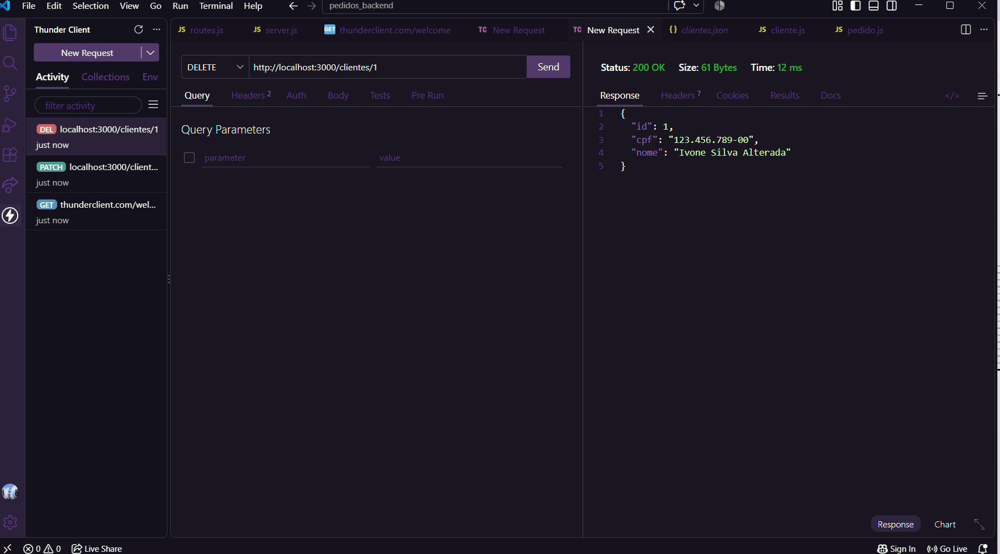
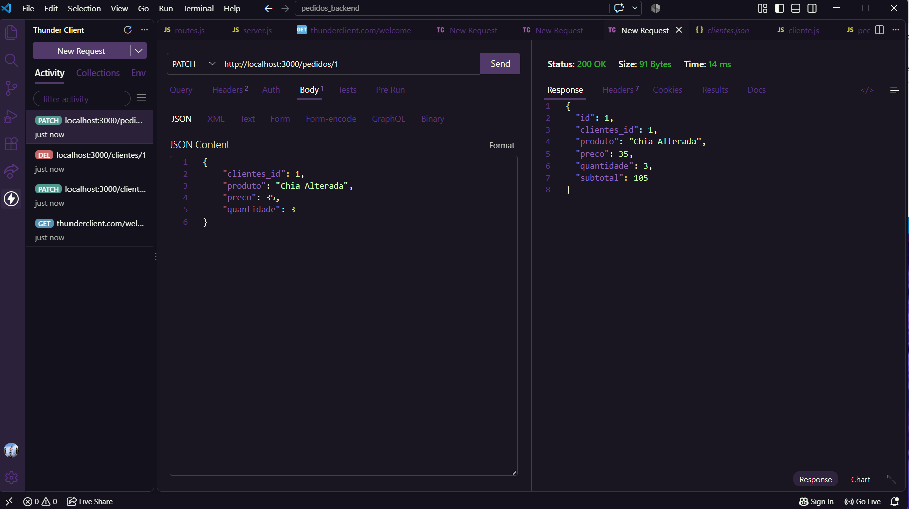
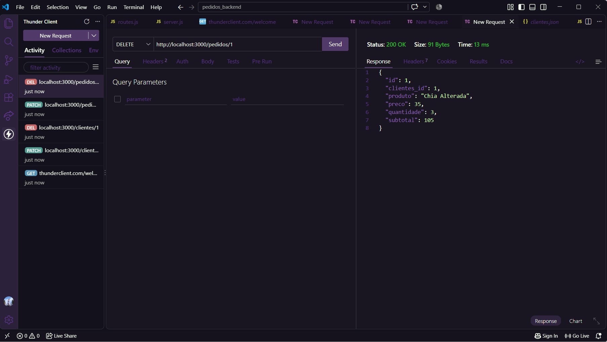

# API de Clientes e Pedidos

## Descrição

Projeto desenvolvido para concluir os CRUDs de clientes e pedidos utilizando Node.js, Express e arquitetura MVC.

Nesta atividade foram desenvolvidas as funcionalidades de:

- Criar clientes
- Listar clientes
- Alterar clientes
- Excluir clientes
- Criar pedidos
- Listar pedidos
- Alterar pedidos
- Excluir pedidos

Os testes das funcionalidades de alteração e exclusão foram realizados utilizando o Thunder Client.

---

## Tecnologias utilizadas

- Node.js
- Express
- JavaScript
- Thunder Client
- JSON
- GitHub

---

## Rotas da API

### Clientes

| Método | Rota | Função |
|---|---|---|
| GET | `/clientes` | Listar clientes |
| POST | `/clientes` | Criar cliente |
| PATCH | `/clientes/:id` | Alterar cliente |
| DELETE | `/clientes/:id` | Excluir cliente |

### Pedidos

| Método | Rota | Função |
|---|---|---|
| GET | `/pedidos` | Listar pedidos |
| POST | `/pedidos` | Criar pedido |
| PATCH | `/pedidos/:id` | Alterar pedido |
| DELETE | `/pedidos/:id` | Excluir pedido |

---

# Testes no Thunder Client

## 1. Alteração de Cliente

Foi realizada a alteração do cliente com ID 1 através da rota:

`PATCH /clientes/1`

O nome do cliente foi alterado para **Ivone Silva Alterada**.

O teste retornou **200 OK**.

---

## 2. Exclusão de Cliente

Foi realizada a exclusão do cliente com ID 1 através da rota:

`DELETE /clientes/1`

O teste retornou **200 OK**, confirmando a exclusão do cliente.

---

## 3. Alteração de Pedido

Foi realizada a alteração do pedido com ID 1 através da rota:

`PATCH /pedidos/1`

Os dados alterados foram:

- Produto: Chia Alterada
- Preço: 35
- Quantidade: 3
- Subtotal: 105

O teste retornou **200 OK**.

---

## 4. Exclusão de Pedido

Foi realizada a exclusão do pedido com ID 1 através da rota:

`DELETE /pedidos/1`

O teste retornou **200 OK**, confirmando a exclusão do pedido.

---

## Conclusão

Os CRUDs de clientes e pedidos foram concluídos com as funcionalidades de alteração e exclusão.

Todos os testes foram realizados no Thunder Client e retornaram **200 OK**, comprovando o funcionamento das rotas desenvolvidas.
